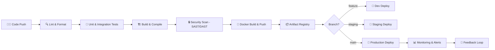

<div align="center">

<!-- Animated Header -->


<!-- Typing SVG -->
[](https://git.io/typing-svg)

<br/>

<!-- Profile Views & Social Badges -->

[](https://linkedin.com/in/sangeethkumar)
[](https://twitter.com/sangeethkumar)
[](https://specdin.com)
[](mailto:sangeeth@specdin.com)

</div>

---

## 🧑‍💻 About Me

```yaml
name: Sangeethkumar
role: Founder & CEO @ Specd In | Full-Stack Engineer
location: Tamil Nadu, India 🇮🇳
experience: Multi-domain Developer (Web · Mobile · Cloud · DevOps · AI/ML)

company:
  name: Specd In
  focus: Crafting next-gen digital products & developer tooling
  mission: Spec it. Build it. Ship it.

passions:
  - Building scalable architectures from scratch
  - Automating everything with CI/CD pipelines
  - Open-source contribution & community building
  - Turning coffee ☕ into production-grade code

currently:
  - 🔭 Building the next big product at Specd In
  - 🌱 Deep-diving into AI/ML & LLM Engineering
  - 🤝 Open to collaborations on innovative projects
  - 📝 Writing dev blogs & technical documentation

fun_fact: "I don't just write code — I architect solutions."
```

---

## 🏢 Specd In — *My Company*

<div align="center">

> **Specd In** is a technology company focused on building cutting-edge software products, developer tools, and scalable cloud solutions. We transform bold ideas into shipped products — fast, clean, and with precision.

[](https://specdin.com)
[](https://specdin.com/careers)

</div>

---

## ⚙️ CI/CD Pipeline & DevOps Arsenal



### 🛠️ Pipeline Tools

| Stage | Tools |
|-------|-------|
| **Version Control** |    |
| **CI/CD** |     |
| **Containerization** |    |
| **IaC** |    |
| **Monitoring** |    |
| **Security** |   |

---

## 🧰 Full Tech Stack

### 🌐 Frontend


### ⚙️ Backend


### 📱 Mobile


### 🗄️ Databases


### ☁️ Cloud & Infrastructure


### 🤖 AI / ML


---

## 🚀 Developer Actions & Workflows

<details>
<summary><b>🔁 GitHub Actions Workflows I Use</b></summary>

```yaml
# .github/workflows/ci-cd.yml — Sangeethkumar's Standard Pipeline
name: 🚀 CI/CD Pipeline

on:
  push:
    branches: [main, staging, develop]
  pull_request:
    branches: [main]

jobs:
  lint-and-test:
    name: 🔍 Lint, Format & Test
    runs-on: ubuntu-latest
    steps:
      - uses: actions/checkout@v4
      - name: Setup Node
        uses: actions/setup-node@v4
      - run: npm ci
      - run: npm run lint
      - run: npm run test:coverage

  security-scan:
    name: 🔒 Security Audit
    runs-on: ubuntu-latest
    steps:
      - uses: actions/checkout@v4
      - uses: snyk/actions/node@master
        env:
          SNYK_TOKEN: ${{ secrets.SNYK_TOKEN }}

  docker-build:
    name: 🐳 Build & Push Docker Image
    needs: [lint-and-test, security-scan]
    runs-on: ubuntu-latest
    steps:
      - uses: actions/checkout@v4
      - uses: docker/build-push-action@v5
        with:
          push: true
          tags: ghcr.io/sangeethkumar/${{ github.event.repository.name }}:latest

  deploy:
    name: 🚀 Deploy to Production
    needs: docker-build
    runs-on: ubuntu-latest
    if: github.ref == 'refs/heads/main'
    steps:
      - name: Deploy via ArgoCD
        run: argocd app sync my-app --force
```

</details>

<details>
<summary><b>🧪 Testing Strategy</b></summary>

- ✅ **Unit Tests** — Jest, Vitest, PyTest, Go Test
- ✅ **Integration Tests** — Supertest, Testcontainers
- ✅ **E2E Tests** — Playwright, Cypress
- ✅ **Load Tests** — k6, Locust
- ✅ **Contract Tests** — Pact
- ✅ **Coverage** — Minimum 80% enforced via CI gates

</details>

<details>
<summary><b>🔐 Security Practices</b></summary>

- 🔑 Secrets managed via **HashiCorp Vault** & **GitHub Secrets**
- 🛡️ SAST scanning with **SonarQube** on every PR
- 📦 Dependency auditing with **Snyk** & **Dependabot**
- 🔏 Image signing with **Cosign** (sigstore)
- 🌐 WAF & DDoS protection via **Cloudflare**
- 🔍 Runtime security with **Falco**

</details>

---

## 📊 GitHub Stats

<div align="center">


</div>

<div align="center">

[](https://git.io/streak-stats)

</div>

<div align="center">

[](https://github.com/ashutosh00710/github-readme-activity-graph)

</div>

---

## 🏆 GitHub Trophies

<div align="center">

[](https://github.com/ryo-ma/github-profile-trophy)

</div>

---

## 📌 Featured Projects

<div align="center">

[](https://github.com/sangeethkumar/specdin-core)
[](https://github.com/sangeethkumar/devops-toolkit)

</div>

---

## 🎯 2025 Goals & Milestones

```
✅ Launch Specd In v2.0 Platform
✅ Ship 3 open-source developer tools
🔄 Build AI-powered code review pipeline
🔄 Reach 1000+ GitHub stars across repos
⏳ Publish technical articles on Dev.to & Medium
⏳ Speak at a tech conference
⏳ Contribute to 10+ open-source projects
```

---

## 🤝 Open for Collaboration

<div align="center">

| I can help with | I'm looking for |
|----------------|-----------------|
| 🏗️ System Architecture | 🌍 Impactful Open Source Projects |
| ⚙️ DevOps & Pipeline Setup | 🤝 Co-founders & Tech Partners |
| 🚀 Startup Tech Consulting | 💡 Innovative SaaS Ideas |
| 🎓 Mentorship & Code Reviews | 🧑‍🤝‍🧑 Developer Community Building |

</div>

---

## 📫 Connect with Me

<div align="center">

[](https://linkedin.com/in/sangeethkumar)
[](https://twitter.com/sangeethkumar)
[](https://dev.to/sangeethkumar)
[](https://medium.com/@sangeethkumar)
[](https://youtube.com/@sangeethkumar)
[](https://discord.gg/specdin)

</div>

---

<div align="center">

### 💬 *"Code is poetry. I write epics."*

**— Sangeethkumar, Founder @ Specd In**


</div>
