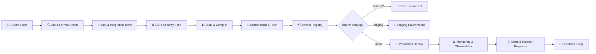

<div align="center">

<!-- Animated Header -->


<!-- Typing SVG -->
[](https://git.io/typing-svg)

<br/>

<!-- Badges Row -->

[](https://specd.in)
[](https://twitter.com/sangeethkumar)
[](mailto:sangeeth@specd.in)

</div>

---

## 🧑‍💻 About Me

```yaml
name        : Sangeethkumar
role        : Founder & CEO @ Specd In | Full-Stack Engineer
location    : Tamil Nadu, India 🇮🇳
website     : https://specd.in

company:
  name      : Specd In
  web       : specd.in
  mission   : "Spec it. Build it. Ship it."
  focus:
    - Next-gen digital products
    - Developer tooling & automation
    - Scalable cloud-native platforms

expertise:
  - Full-Stack Web Development
  - Mobile Engineering (iOS · Android · Cross-Platform)
  - Cloud Architecture & DevOps
  - AI / ML Engineering
  - System Design & Microservices
  - CI/CD Pipeline Automation

currently:
  - 🔭 Scaling Specd In to the next level
  - 🌱 Deep-diving into LLM Engineering & AI Agents
  - 🤝 Open to high-impact collaborations
  - 📝 Writing technical content on specd.in/blog

fun_fact    : "I don't just write code — I architect experiences."
```

---

## 🏢 Specd In — *Built by Me, Powered by Passion*

<div align="center">

> **Specd In** is a technology company building cutting-edge software products, developer tools, and cloud-native solutions.
> We go from spec to production with speed, precision, and craft.

[](https://specd.in)
[](https://specd.in/careers)
[](https://specd.in/blog)

</div>

---

## ⚙️ CI/CD Pipeline Architecture



### 🛠️ Pipeline Toolchain

| Stage | Tools |
|-------|-------|
| **Version Control** |    |
| **CI/CD** |     |
| **Containerization** |    |
| **Infrastructure as Code** |    |
| **Monitoring** |    |
| **Security** |    |

---

## 🧰 Complete Tech Stack

### 🌐 Frontend


### ⚙️ Backend


### 📱 Mobile


### 🗄️ Databases


### ☁️ Cloud & Infrastructure


### 🤖 AI / ML


---

## 🚀 Developer Actions & Workflows

<details>
<summary><b>⚙️ GitHub Actions — Standard CI/CD Pipeline</b></summary>

```yaml
# .github/workflows/ci-cd.yml
name: 🚀 Specd In — CI/CD Pipeline

on:
  push:
    branches: [main, staging, develop]
  pull_request:
    branches: [main]

env:
  REGISTRY: ghcr.io
  IMAGE_NAME: ${{ github.repository }}

jobs:

  lint-and-test:
    name: 🔍 Lint, Format & Test
    runs-on: ubuntu-latest
    steps:
      - uses: actions/checkout@v4
      - uses: actions/setup-node@v4
        with:
          node-version: 20
          cache: npm
      - run: npm ci
      - run: npm run lint
      - run: npm run format:check
      - run: npm run test:coverage
      - uses: codecov/codecov-action@v4

  security-scan:
    name: 🔒 Security Audit
    runs-on: ubuntu-latest
    steps:
      - uses: actions/checkout@v4
      - uses: snyk/actions/node@master
        env:
          SNYK_TOKEN: ${{ secrets.SNYK_TOKEN }}
      - uses: aquasecurity/trivy-action@master
        with:
          scan-type: fs
          severity: CRITICAL,HIGH

  build-and-push:
    name: 🐳 Build & Push Docker Image
    needs: [lint-and-test, security-scan]
    runs-on: ubuntu-latest
    steps:
      - uses: actions/checkout@v4
      - uses: docker/login-action@v3
        with:
          registry: ${{ env.REGISTRY }}
          username: ${{ github.actor }}
          password: ${{ secrets.GITHUB_TOKEN }}
      - uses: docker/build-push-action@v5
        with:
          push: true
          tags: ${{ env.REGISTRY }}/sangeethkumar/${{ github.event.repository.name }}:latest

  deploy-staging:
    name: 🔬 Deploy to Staging
    needs: build-and-push
    runs-on: ubuntu-latest
    if: github.ref == 'refs/heads/staging'
    steps:
      - name: Deploy via ArgoCD (Staging)
        run: argocd app sync staging-app --server ${{ secrets.ARGOCD_URL }}

  deploy-production:
    name: 🚀 Deploy to Production
    needs: build-and-push
    runs-on: ubuntu-latest
    if: github.ref == 'refs/heads/main'
    environment:
      name: production
      url: https://specd.in
    steps:
      - name: Deploy via ArgoCD (Production)
        run: argocd app sync prod-app --server ${{ secrets.ARGOCD_URL }} --force
      - name: Notify Deployment
        run: |
          curl -X POST ${{ secrets.SLACK_WEBHOOK }} \
          -d '{"text":"✅ Production deployed successfully — specd.in"}'
```

</details>

<details>
<summary><b>🧪 Testing Strategy</b></summary>

| Type | Tools | Coverage Target |
|------|-------|----------------|
| **Unit Tests** | Jest, Vitest, PyTest, Go Test | ≥ 80% |
| **Integration Tests** | Supertest, Testcontainers | ≥ 70% |
| **End-to-End Tests** | Playwright, Cypress | Critical paths |
| **Load & Performance** | k6, Locust | p95 < 200ms |
| **Contract Tests** | Pact | All API boundaries |
| **Visual Regression** | Chromatic, Percy | UI components |

</details>

<details>
<summary><b>🔐 Security Practices</b></summary>

- 🔑 Secrets managed via **HashiCorp Vault** & **GitHub Encrypted Secrets**
- 🛡️ **SAST scanning** with SonarQube on every pull request
- 📦 **Dependency auditing** with Snyk & Dependabot auto-updates
- 🔏 **Container image signing** with Cosign (Sigstore)
- 🌐 **WAF & DDoS protection** via Cloudflare (specd.in)
- 🔍 **Runtime security** monitoring with Falco
- 🔐 **Zero-trust networking** with Tailscale

</details>

<details>
<summary><b>🌿 Git Branching Strategy</b></summary>

```
main          ← production  →  specd.in
  └── staging ← pre-prod testing
        └── develop ← integration branch
              └── feature/xxx ← feature work
              └── fix/xxx     ← bug fixes
              └── chore/xxx   ← maintenance
```

- **Conventional Commits** enforced via `commitlint`
- **Semantic Versioning** automated with `semantic-release`
- **PR templates** and CODEOWNERS for every repo
- **Branch protection rules** on `main` and `staging`

</details>

---

## 📊 GitHub Stats

<div align="center">


</div>

<div align="center">

[](https://git.io/streak-stats)

</div>

<div align="center">

[](https://github.com/ashutosh00710/github-readme-activity-graph)

</div>

---

## 🏆 GitHub Trophies

<div align="center">

[](https://github.com/ryo-ma/github-profile-trophy)

</div>

---

## 📌 Featured Projects

<div align="center">

[](https://github.com/sangeethkumar/specdin-platform)
[](https://github.com/sangeethkumar/devops-toolkit)

</div>

---

## 🎯 2025 Milestones

```
✅ Launched specd.in — Company Website Live
✅ Shipped CI/CD automation toolkit
🔄 Building AI-powered code review pipeline
🔄 Growing Specd In's open-source presence
⏳ Publish monthly tech deep-dives on specd.in/blog
⏳ Speak at a developer conference
⏳ Contribute to 10+ open-source projects
⏳ Launch Specd In SaaS v2.0
```

---

## 🤝 Open to Collaboration

<div align="center">

| I Can Help You With | I'm Looking For |
|---------------------|-----------------|
| 🏗️ System & Cloud Architecture | 🌍 Impactful Open Source Projects |
| ⚙️ DevOps & CI/CD Pipeline Setup | 🤝 Co-founders & Tech Partners |
| 🚀 Startup Tech Strategy & Consulting | 💡 Innovative SaaS & Dev Tools Ideas |
| 🎓 Mentoring & Code Reviews | 🧑‍🤝‍🧑 Developer Community Building |

</div>

---

## 📫 Connect with Me

<div align="center">

[](https://specd.in)
[](https://twitter.com/sangeethkumar)
[](https://dev.to/sangeethkumar)
[](https://medium.com/@sangeethkumar)
[](https://youtube.com/@sangeethkumar)
[](https://discord.gg/specdin)
[](mailto:sangeeth@specd.in)

</div>

---

<div align="center">

### 💬 *"Code is poetry. I write epics."*

**— Sangeethkumar, Founder @ [Specd In](https://specd.in)**


</div>
